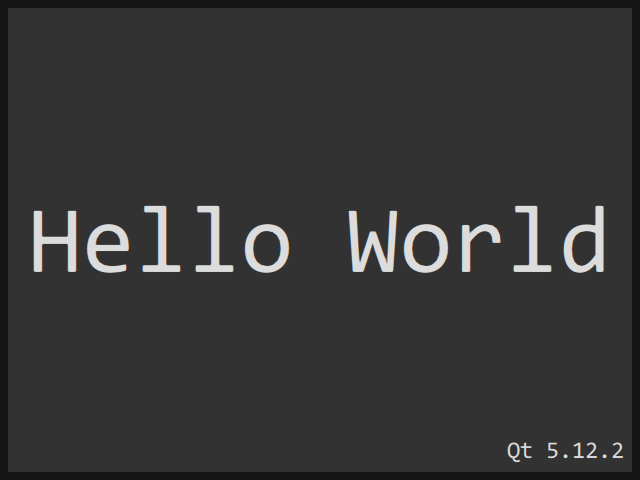

# QuickWindow

QuickWindow es una ventana sin marco de QtQuick para la plataforma Windows. 

# Características principales

- Redimensionamiento de lados y esquinas.
- Arrastre y ajuste (snapping).
- Maximizar con doble clic.
- Atajos de teclado.
- Soporte para OpenGL y Software.
- Soporte táctil.

## Tecnología

QuickWindow está construido en C++ con el [Qt framework](https://github.com/qtproject).

## Plataformas

- Windows XP y versiones posteriores.

## Requisitos

- [Qt](https://download.qt.io/official_releases/qt) 4.8.0 / 5.5.0 o posterior.

En Windows:
- [MinGW](https://sourceforge.net/projects/mingw) o [Git for Windows](https://git-for-windows.github.io) con g++ 4.9.2 o posterior.

Recomendado:
- [Qt Creator](https://download.qt.io/official_releases/qtcreator) 3.6.0 o posterior.

## Compilación

Puedes compilar QuickWindow con Qt Creator:
- Abre [QuickWindow.pro](QuickWindow.pro).
- Haz clic en `Build > Build all`.

O mediante la consola:

    qmake -r
    make (mingw32-make en Windows)

## Autor

- Benjamin Arnaud aka [bunjee](https://bunjee.me) | <bunjee@omega.gg>

### Uso de la Licencia Pública General Reducida de GNU

Sky kit puede utilizarse bajo los términos de la Licencia Pública General Reducida de GNU versión 3 publicada por la Free Software Foundation y que aparece en el archivo LICENSE.md incluido en el empaquetado de este archivo. Por favor, revise la siguiente información para asegurarse de que se cumplan los requisitos de la Licencia Pública General Reducida de GNU: https://www.gnu.org/licenses/lgpl.html.
