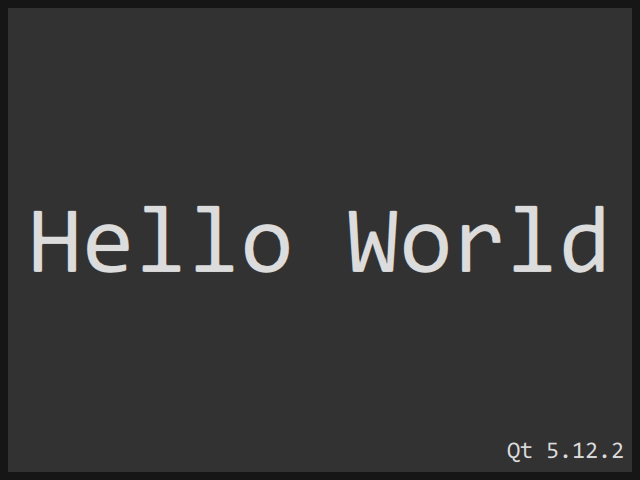

# QuickWindow

QuickWindow is a QtQuick frameless window for the Windows platform. 

# Highlights

- Side and corner resize.
- Dragging and snapping.
- Double click maximize.
- Keyboard shortcuts.
- OpenGL and Software support.
- Touch support.

## Technology

QuickWindow is built in C++ with the [Qt framework](http://github.com/qtproject).

## Platforms

- Windows XP and later.

## Requirements

- [Qt](http://download.qt.io/official_releases/qt) 4.8.0 / 5.5.0 or later.

On Windows:
- [MinGW](http://sourceforge.net/projects/mingw) or [Git for Windows](http://git-for-windows.github.io) with g++ 4.9.2 or later.

Recommended:
- [Qt Creator](http://download.qt.io/official_releases/qtcreator) 3.6.0 or later.

## Build

You can build QuickWindow with Qt Creator:
- Open [QuickWindow.pro](QuickWindow.pro).
- Click on `Build > Build all`.

Or the console:

    qmake -r
    make (mingw32-make on Windows)

## Author

- Benjamin Arnaud aka [bunjee](http://bunjee.me) | <bunjee@omega.gg>

### GNU Lesser General Public License Usage

Sky kit may be used under the terms of the GNU Lesser General Public License version 3 as published
by the Free Software Foundation and appearing in the LICENSE.md file included in the packaging of
this file. Please review the following information to ensure the GNU Lesser General Public License
requirements will be met: https://www.gnu.org/licenses/lgpl.html.
